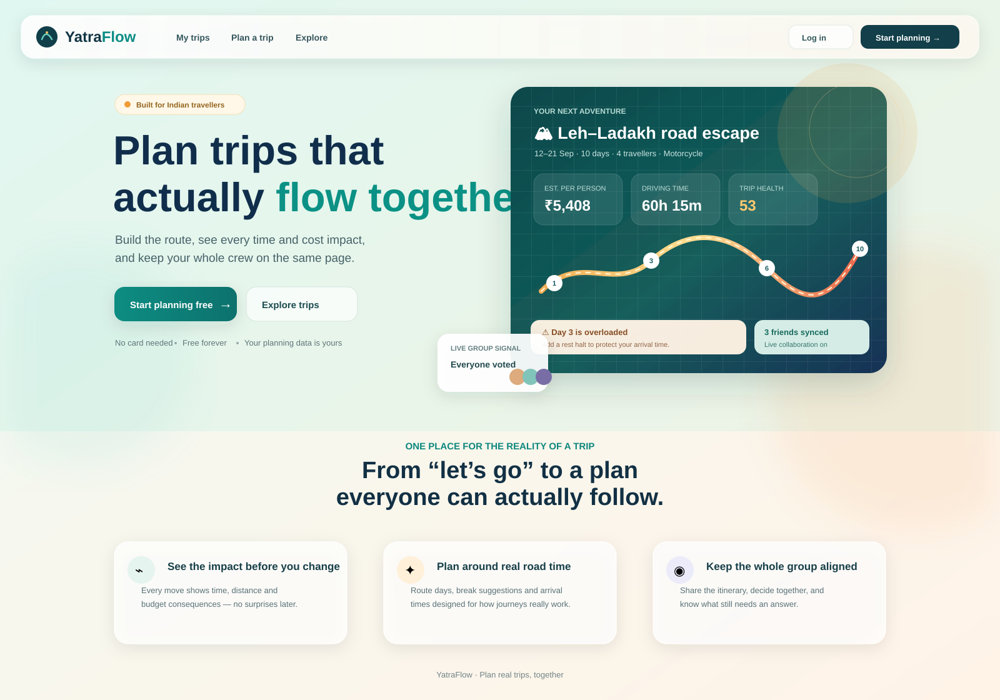

<div align="center">

# YatraFlow 🇮🇳

**Plan Indian trips together — not in a chaotic group chat.**

A collaborative travel-planning web app, built India-first. Real multi-day itineraries, transparent cost & time estimates in ₹, group voting on stops, decisions that settle debates, and interactive maps of your whole route.

**Free to use. No API key needed for maps, weather or routing.**

<br />

<a href="https://yatraflow-blond.vercel.app"></a>
&nbsp;
<a href="https://github.com/hasnaina955/Yatraflow/releases"></a>
&nbsp;
<a href="https://github.com/hasnaina955/Yatraflow"></a>
&nbsp;
<a href="https://github.com/hasnaina955/Yatraflow/network/members"></a>

<br />

<a href="https://github.com/hasnaina955/Yatraflow"></a>
<a href="https://vitejs.dev"></a>
<a href="https://www.typescriptlang.org"></a>
<a href="https://supabase.com"></a>
<a href="https://maplibre.org"></a>

</div>

<br />



---

## What you get
<table width="100%">
<tr>
<td width="50%" valign="top">

#### 📍 Plan

- **Create trips** — start + ordered destinations (real place autocomplete), dates, crew size, transport mode, budget and travel style
- **Day-by-day timeline** — reorder / move stops between days, opening hours, priorities, route sparklines, collapsible headers
- **One journey per day, however far you drive** — a real arrival clock, travelling strips for pure-travel legs, halts on any driving day, suggested real stop spots along the route
- **Leg-aware insertion** — picking a place auto-fills road distance, travel time and fuel cost

</td>
<td width="50%" valign="top">

#### 💰 Budget & time (transparently)

- **Schedule engine** — simulates each day leg-by-leg (OSRM road distances, per-mode speeds and ₹/km costs); flags tight days, missed check-ins, late arrivals
- **Budget engine** — totals split per-person vs group, essential vs optional, category breakdown, hotel nights
- **Every rupee attributed** — per-day cost bars show what each day really costs (expenses + that day's drive) against a daily-average line; hot days light up amber with a trim suggestion
- **Split expenses fairly** — tag who paid on any expense and a balances card shows who owes whom, with the simplest set of settlements spelled out
- **Impact Preview** — before you accept a suggestion, see ±time, ±distance, ±cost, new or cleared warnings
- Every estimate states its assumptions on-screen. **No fake live traffic or prices — ever.**

</td>
</tr>
<tr>
<td width="50%" valign="top">

#### 🗺 Maps & routing

- **Interactive MapLibre maps** — numbered stop pins per day, colour-coded routes, day filters, light/dark basemaps (OpenFreeMap — keyless, no request caps)
- **Real road routing** (OSRM) with silent offline fallback — planning never blocks
- **Nearby POIs** along your route (verified coordinates) plus fatigue-aware stop suggestions for long drives
- **Weather along the route** — per-day forecast from Open-Meteo (free, keyless) with icon, min/max °C, rain chance
- **Expandable map** — filter pills, marker-key chip, full-screen Expand mode

</td>
<td width="50%" valign="top">

#### 👥 Collaborate & share

- **Invite by link** — friends join as owner / editor / commenter / viewer (enforced by Postgres RLS)
- **One group-input stream** — stop ideas and group decisions share one tab; whatever needs *your* vote floats to the top with a sidebar digest, and decision cards show exactly who voted for what and where the tally leans
- **Decisions** — structured polls with per-option cost/time impact and context, votes, resolve
- **Publish itineraries** to the public Explore gallery; readers copy any trip in one click
- **Creators get a public page** — `#/creator/:id` gathers a creator's bio, links, track record and every itinerary they've published, shareable in one link
- **Export / import** JSON, or a self-contained snapshot link (`#/share/<payload>`, zero server storage)
- **AI companion drawer** — deterministic, trip-grounded answers that always cite assumptions

</td>
</tr>
</table>

---

## ✨ The v0.36–v0.37 rework, in plain words

Two recent releases rebuilt the money and group sides of the app, and gave creators a home:

- **The Budget tab answers "are we over?" in one glance.** Four tiles up top (per person, per day, remaining vs target, % spent), then a bar for every day of the trip so you can see *which* day is expensive — not just that the trip is. A day running hot turns amber with a one-line trim suggestion. Adding an expense is a single row at the very top — name, amount, done — and every line remembers **who paid**, so a card on the right tells the group exactly who owes whom, plus the shortest list of transfers that settles everything.
- **Group ideas and decisions merged into one tab.** Stop ideas and group decisions used to live in two places; now they share one stream with simple filters. Anything waiting for *your* vote floats to the top (and into a sidebar digest), decision cards show the actual voters behind each option with a plain verdict — "tally leans Marari beach" — while editors keep the final call. The composer no longer guesses: you pick the real day, category and transport cost, and a suggestion without a place pins to your trip's start instead of a hardcoded Munnar. The constant "someone voted" pings are gone too — you hear when a question is raised and when it's settled.
- **Every creator has a shareable page.** `#/creator/:id` shows a creator's bio, social links, lifetime views and forks, and everything they've published — reachable from any Explore card, any public itinerary ("More from X"), or Profile. Your publications list became a small dashboard: views and forks per itinerary, one-click edit, and if you change a trip after publishing, a "page behind itinerary" flag nudges you to sync it.
- **Quiet consistency fixes** — dropdowns finally match the text fields they sit beside (the open list takes the app's colors too), every filter has a proper empty state with a way out, and Explore sorts by newest as well as popularity.

<details>
<summary><b>See the full tour of features</b></summary>

<br />

The depth below ships in the app today — it is condensed here to keep the front door scannable.

- **Fuel-accurate costs** — car/bike trips state fuel economy (km/L)and optionally local pump price (default ₹105/L national average); legs are priced as `distance ÷ economy × price`, and the return to start is included by default (toggleable).
- **Travel stops act as real halts** — pure-travel legs render as travelling strips; stay days show "Based in …"; the drive home appears only on the return day, never double-counted.
- **Fatigue-aware stop planner** — splits long drives into stretch / meal / fuel / overnight segments and matches each to the best real place by purpose (night halts anchored on key cities; vehicle-profile aware for fuel range, EV/CNG queries).
- **Opening hours auto-fill** from OSM Overpass where relevant (POIs, temples, food, hotels), context-aware.
- **Location autocomplete** — Mappls when a key is set, else Open-Meteo + Wikipedia fallback.

</details>

---

## 🚀 Getting started

```bash
git clone https://github.com/hasnaina955/Yatraflow.git
cd Yatraflow
npm install

# Configure Supabase (free project at supabase.com, then:)
cp .env.example .env.local   # VITE_SUPABASE_URL + VITE_SUPABASE_ANON_KEY
# Apply the schema (SQL editor in the dashboard, or with PGCONN set):
#   node scripts/apply-schema.mjs

npm run dev        # → http://localhost:5173
```

**One-command start (Windows):** `./scripts/start.ps1` boots install-if-needed dev server (`-Test` runs the suite, `-Build` runs the build; `make-dev-shortcut.ps1` adds a desktop shortcut)

You'll need a free [Supabase](https://supabase.com) project for accounts + data; the maps / weather / geocoding services the app calls are all free and keyless

## 👤 Accounts & demo content

- **Sign up** with any email + password (min 8 chars — new accounts get a seeded Kerala demo trip on first login
- Already have trips? Use the **🚀 Load demo trips** button on My Trips anytime
- Your data lives in Supabase and follows you across devices; invited collaborators act per their role, enforced by Postgres RLS

---
## 🛠 Tech stack

| Layer | Choice | Why |
|---|---|---|
| Build | [Vite 8](https://vitejs.dev) | Instant dev server, zero-config builds |
| UI | React 18 + TypeScript (strict) | No router lib or UI kit — hash routing + hand-rolled components stay lightweight |
| State | `useSyncExternalStore` over a module store | Tiny reactive cache hydrated from Supabase; every mutation writes through |
| Maps | [mapcn](https://github.com/AnmolSaini16/mapcn) (MapLibre GL) | [OpenFreeMap](https://openfreemap.org) basemaps tick light/dark — no key, no signup, no caps |
| Backend | [Supabase](https://supabase.com) (Postgres + Auth + RLS) | Free tier covers the MVP; JSONB keeps trip internals denormalized |
| Routing / geo | OSRM, Open-Meteo, Wikipedia, Overpass | Free + keyless, India-biasable; optional Google / Mappls keys behind a failing-open facade |

Routing is hash-based (`#/trip/:id`, `#/pub/:slug`, `#/creator/:id`, `#/invite/:id`) so the static build runs on any host with no rewrites.

## 📁 Project structure

```
src/
├── main.tsx           # Entry — mounts <App/> inside <ErrorBoundary/>
├── App.tsx            # Hash router, nav shell, footer, notifications
├── styles.css         # Single hand-written stylesheet (light+dark via data-theme)
├── data/              # types.ts domain model · seed.ts demo content
├── store/store.ts     # Supabase-backed reactive cache + all mutations
├── lib/               # engine.ts · impact.ts · ai.ts · ridePlan.ts · geocode.ts
│                      # routing.ts · snapshot.ts · weather.ts
├── components/        # ui.tsx · StopEditor.tsx · TripMap.tsx · ImpactPreview.tsx · PubCard.tsx · mapcn/
└── pages/             # Landing · Auth · TripsList · CreateTrip · TripWorkspace · Explore
                       # PublicItinerary · CreatorPage · Profile + trip/ (one file per workspace tab)
```

Deep dives: [docs/ARCHITECTURE.md](docs/ARCHITECTURE.md) (data model, engine math, store), [DESIGN_TOKENS.md](DESIGN_TOKENS.md) (design tokens), [docs/README.md](docs/README.md) (full index).

---

## 🗺 Data sources, basemaps & attribution

Every map/data service is **free and keyless** unless the row says otherwise — the app never requires an API key to render a map.

| Concern | Provider | Licensing / terms |
|---|---|---|
| **Basemap tiles** | [OpenFreeMap](https://openfreemap.org) (OpenMapTiles-schema) | MIT — no request limits; map data © [OSM](https://www.openstreetmap.org/copyright) contributors (ODbL) |
| Road routing | [OSRM](https://project-osrm.org/) demo server | Free, keyless; haversine fallback works offline |
| Weather | [Open-Meteo](https://open-meteo.com) | Free, keyless, CC-BY 4.0 |
| Geocoding / POIs | Open-Meteo, Wikipedia geosearch, [Overpass (OSM)](https://overpass-api.de) | Free / ODbL |
| Place autocomplete (opt-in) | [Mappls](https://about.mappls.com/api/) when `VITE_MAPPLS_KEY` is set | Free India dev tier, key required |
| Places & Routes (opt-in) | [Google Maps Platform](https://mapsplatform.google.com) when `VITE_GOOGLE_MAPS_API_KEY` is set | Needs billing; client-side quota guard caps each SKU at 80% of free allowance |

MapLibre renders the required OSM/OpenMapTiles credit in every map corner.

---

## ☁️ Deployment

Static hosting is enough. The repo auto-deploys to **Vercel** on every push to `main` (`npm run build`, output `dist/`). Any static host works — Netlify, GitHub Pages behind a base path — because routing is hash-based.

**Preview builds need the Supabase vars too.** Vite inlines `VITE_SUPABASE_URL` / `VITE_SUPABASE_ANON_KEY` at build time and Vercel scopes them per environment — tick **Production, Preview and Development**, then **Redeploy**; the build guard in `vite.config.ts` fails a Vercel deploy if either is missing. See [docs/DEPLOYMENT.md](docs/DEPLOYMENT.md#if-login-fails-on-a-preview-but-works-on-production).

---

## 📌 MVP constraints (intentional)

- ❌ Hotel/flight **booking** — placeholder buttons only ("no payments in this MVP")
- ❌ **Payments** — no gateway integration
- ❌ **Live traffic/prices** — all estimates are transparent formulas with stated assumptions
- ❌ INR is the default and only currency

These are extension points, not oversights — see ARCHITECTURE.md's "Swapping things out".

## 🤝 Contributing

PRs welcome! Keep TypeScript strict clean, match the existing style (plain CSS in `styles.css`, no new UI/router/state libs without discussion), preserve the transparency promise, and respect the MVP constraints. See [CONTRIBUTING.md](CONTRIBUTING.md).

---

<div align="center">

*Built India-first. Yatra (यात्रा) means journey.* 🧭

</div>
